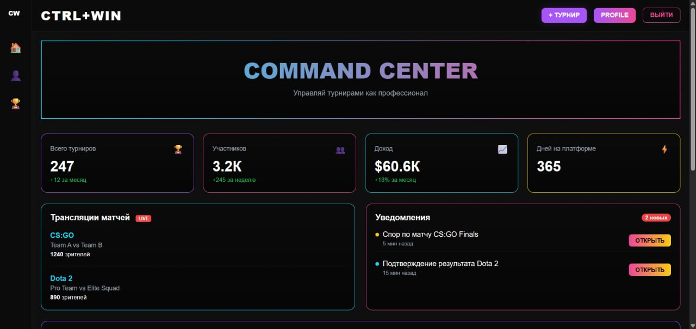
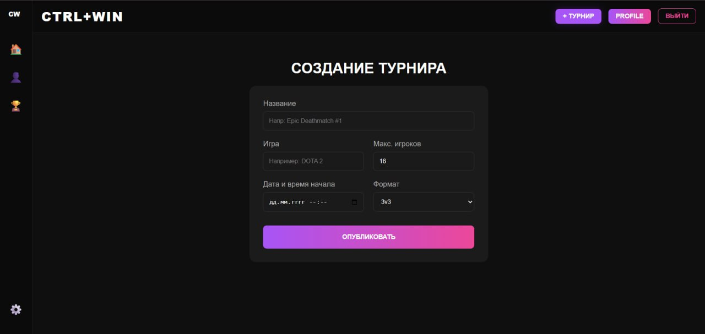

#  Ctrl+Win — Платформа для автоматизации киберспортивных лиг

**Ctrl+Win** — это профессиональное Fullstack-решение для организаторов киберспортивных событий. Платформа автоматизирует рутинные процессы: генерацию турнирных сеток, продвижение участников по этапам и финансовый учет призовых фондов.


### Demo


### Скриншоты ключевых экранов
| Главная | Создание турнира |
| :---: | :---: |
|  |  |

##  Основные возможности
* **Автоматизация сеток**: Генерация турнирных таблиц в один клик.
* **Управление участниками**: Удобный интерфейс регистрации и контроля статусов.
* **Финансовый модуль**: Учет и распределение призовых фондов.
* **Docker-ready**: Быстрый запуск всей инфраструктуры в одну команду.

## Архитектура проекта
Система построена на принципах разделения ответственности (**Separation of Concerns**), что обеспечивает легкость масштабирования.

```plaintext
├── backend/
│   ├── models/       # Слой данных (database.py, models.py)
│   ├── routes/       # API-контроллеры (base, tournaments, users)
│   ├── services/     # Бизнес-логика (расчет сеток, логика финансов)
│   ├── schemas.py    # Pydantic-модели (валидация запросов и ответов)
│   ├── config.py     # Централизованное управление настройками и БД
│   ├── utils.py      # Вспомогательные функции и хелперы
│   ├── Dockerfile    # Инструкции по сборке образа бэкенда
│   └── main.py       # Точка входа, настройка lifespan и CORS
├── frontend/
│   ├── src/
│   │   ├── components/ # Переиспользуемые атомарные UI-блоки
│   │   ├── pages/      # Основные страницы (Dashboard, TournamentView)
│   │   ├── styles/     # Темы, CSS-эффекты и Tailwind конфиг
│   │   ├── global/     # API-клиенты, константы и провайдеры
│   │   ├── layout/     # Обертки интерфейса (Sidebar, Navbar)
│   │   ├── App/        # Роутинг и главная логика React
│   │   └── main.jsx    # Точка входа фронтенда
│   ├── index.html      # Базовый HTML-шаблон
│   ├── package.json    # Зависимости и скрипты фронтенда
│   └── vite.config.js  # Конфигурация сборщика Vite
├── docker-compose.yml  # Оркестрация всей системы (Backend, Frontend, DB)
└── README.md
```
## Технологический стек

    Backend: FastAPI (Python), SQLAlchemy 2.0 (Async), PostgreSQL.

    Frontend: React, Vite, Tailwind CSS.

    Инфраструктура: Docker & Docker Compose.

## 📊 Материалы проекта
Подробное описание бизнес-концепции, технических решений и перспектив развития:

 * [📕 Презентация (PDF)](https://github.com/nightly228/it-project_Ctrl-Win/raw/master/assets/winpres.pdf)

## Установка и запуск
### С использованием Docker (рекомендуется)
```bash
docker-compose up --build
```
### Ручной запуск
1. Backend:
```bash
cd backend
pip install -r requirements.txt
uvicorn main:app --reload
```
2. Frontend:
```bash
cd frontend
npm install
npm run dev
```

## Контакты
Проект разработан в рамках курса IT-проекты. Готов к внедрению в реальные киберспортивные лиги.